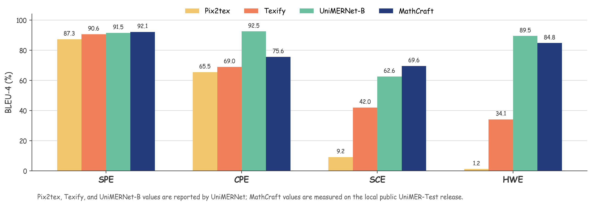

# MathCraft Models

Model assets for **MathCraft OCR**, the ONNX-only OCR runtime used by LaTeXSnipper.

MathCraft OCR recognizes formulae, text, and mixed mathematical documents with a compact ONNX model set. This repository provides the model release assets and the source package for the PyPI package `mathcraft-ocr` used by LaTeXSnipper.

## Quick Start

Current PyPI release line: `mathcraft-ocr 0.2.5`.

Install the library and CLI without choosing an ONNX Runtime backend:

```powershell
pip install mathcraft-ocr
mathcraft --help
```

Install exactly one ONNX Runtime backend before running OCR inference.

CPU:

```powershell
pip install "mathcraft-ocr[cpu]"
```

GPU:

```powershell
pip install "mathcraft-ocr[gpu]"
```

Use only one ONNX Runtime backend in the same environment. Do not install `onnxruntime` and `onnxruntime-gpu` together.

LaTeXSnipper's dependency wizard selects the ONNX Runtime GPU wheel line from the detected CUDA toolkit. CUDA 11.x uses the ONNX Runtime CUDA 11 package feed, CUDA 12.x uses the stable PyPI GPU wheels, and CUDA 13.x uses the ONNX Runtime CUDA 13 nightly feed. Static `mathcraft-ocr[gpu]` package metadata cannot inspect the local CUDA toolkit, so CUDA 11.x users installing manually should use the CUDA 11 feed shown by the wizard.

Upgrade the current release with a chosen backend:

```powershell
pip install -U "mathcraft-ocr[gpu]"
mathcraft --help
```

Check the runtime:

```powershell
mathcraft doctor --provider auto
mathcraft models check
mathcraft warmup --profile mixed --provider auto
```

Recognize an image:

```powershell
mathcraft ocr "C:\path\to\formula.png" --profile formula --provider auto --json
```

Mixed OCR to Markdown:

```powershell
mathcraft ocr "C:\path\to\page.png" --profile mixed --provider auto --output result.md
mathcraft ocr "C:\path\to\page.png" --profile mixed --provider auto --output-dir "D:\MathCraft\outputs"
```

When a file is written, the CLI prints the resolved output path:

```text
[MATHCRAFT_OUTPUT] written to D:\MathCraft\outputs\page.md
```

PowerShell custom model cache:

```powershell
$env:MATHCRAFT_HOME="D:\MathCraft\models"
mathcraft doctor --provider auto
```

Persistent user-level cache path:

```powershell
setx MATHCRAFT_HOME "D:\MathCraft\models"
```

Open a new terminal after `setx`.

Restore the default cache path:

```powershell
[Environment]::SetEnvironmentVariable("MATHCRAFT_HOME", $null, "User")
Remove-Item Env:\MATHCRAFT_HOME -ErrorAction SilentlyContinue
mathcraft doctor --provider auto
```

Open a new terminal after removing the persistent variable. The default root is platform-specific:

```text
Windows: %APPDATA%\MathCraft\models
macOS: ~/Library/Application Support/LaTeXSnipper/MathCraft/models
Linux: ${XDG_DATA_HOME:-~/.local/share}/LaTeXSnipper/MathCraft/models
```

## Python API

```python
from mathcraft_ocr import MathCraftRuntime

runtime = MathCraftRuntime(provider_preference="auto")
result = runtime.recognize_mixed(r"C:\path\to\page.png")

print(result.text)
for block in result.blocks:
    print(block.role, block.kind, block.text[:80])
```

## Profiles

| Profile | Use Case | Output |
| --- | --- | --- |
| `formula` | Formula screenshots | LaTeX formula text |
| `text` | Plain text OCR | Text |
| `mixed` | Text + formula documents | Markdown-ready structured text |

## Runtime Release Notes

`mathcraft-ocr 0.2.5` improves multiline formula recognition by retaining aligned short continuation rows, excluding dark screenshot frames, and comparing uncertain wide-line segments with whole-line recognition. The `v1.0.0` formula-recognition asset now uses the MathCraft-owned `mathcraft-formula-rec` identity in its configuration; the ONNX graphs and weights are unchanged.

`mathcraft-ocr 0.2.4` fixes DirectML provider handling for RapidOCR text recognition. CUDA and TensorRT providers enable CUDA runtime options, DirectML enables DirectML runtime options, and CPU remains CPU-only. The active `v1.0.0` ONNX model asset set is unchanged.

`mathcraft-ocr 0.2.3` fixes cross-platform hardware sizing. Memory detection now uses optional `psutil`, Windows API, POSIX `sysconf`, and macOS `vm_stat`, so CPU batch sizing no longer falls back to Windows-only memory data on Linux or macOS. It also moves the default writable model cache to platform-native user data locations on macOS and Linux.

Earlier `0.2.x` releases improved runtime-side formula post-processing without changing the active `v1.0.0` ONNX model asset set. They keep compact fraction expressions whole, avoid splitting matrix-like wide formulas, add relation-aware `aligned` output, and retry severe segmented-line artifacts with safer whole-line or whole-image recognition.

## Model Set

Active release: `v1.0.0`

| Model ID | Runtime | Purpose |
| --- | --- | --- |
| `mathcraft-formula-det` | ONNX | Mathematical formula region detection |
| `mathcraft-formula-rec` | ONNX | Formula-to-LaTeX recognition |
| `mathcraft-text-det` | ONNX | Fast multilingual text detection |
| `mathcraft-text-rec` | ONNX | Fast multilingual text recognition |

Release assets:

```text
mathcraft-formula-det.zip
mathcraft-formula-rec.zip
mathcraft-text-det.zip
mathcraft-text-rec.zip
models.v1.json
SHA256SUMS.txt
```

The runtime downloads the four model archives. `models.v1.json` records their
contents and source URLs, while `SHA256SUMS.txt` provides archive-level integrity
checks for release verification.

Default writable model root:

```text
Windows: %APPDATA%\MathCraft\models
macOS: ~/Library/Application Support/LaTeXSnipper/MathCraft/models
Linux: ${XDG_DATA_HOME:-~/.local/share}/LaTeXSnipper/MathCraft/models
```

The runtime checks the manifest before initialization. Missing or incomplete model folders are repaired automatically by downloading only the affected model asset.

Interrupted downloads are resumable. Partial archives are stored under the active writable model root:

```text
<MATHCRAFT_HOME>\.downloads\<model_id>.zip.part
```

After a model archive is fully downloaded, verified, and extracted, the `.part` file is removed automatically.

## Results

The examples below are generated from MathCraft's structured block output. Boxes show detected roles, order, column metadata, score, and layout flags.

### Abstract Algebra, page 18

Formula-heavy English mathematical prose with dense inline and display formulae.


### Dynamics journal, page 5

Formula-dominant journal page with display equations, anchors, labels, headers, and page numbers.


### Chinese lecture note, page 1

Chinese mathematical document page with mixed text and formula blocks.


### Limits and series, page 1

Sparse title/cover-style page used to check layout stability.


## Reproducible Benchmarks

| Benchmark | Scale | Reported result |
| --- | ---: | --- |
| UniMER-Test | 23,757 formulas | BLEU-4 `0.7946`; official CDM `0.9288` |
| MathWriting test | 7,644 samples | BLEU-4 `0.5467`; official CDM `0.750`; render success `98.63%` |
| OpenStax mixed pages | 200 pages | `0` failures, `0` empty outputs; median `6.65 s/page` |

All recorded runs used `CUDAExecutionProvider`. The datasets cover different tasks and protocols, so the rows are not a model-ranking comparison.



See the [benchmark report, charts, provenance, and reproduction notes](benchmarks/README.md).

## Why It Is Stable

- ONNX Runtime only, no active PyTorch inference dependency.
- Stable MathCraft-owned model IDs and folders.
- Manifest-based file checks and cache repair.
- Resumable model downloads for slow or interrupted networks.
- Formula detection before text OCR.
- Structured blocks for headings, paragraphs, display formulae, headers, page numbers, and columns.

## LaTeXSnipper

LaTeXSnipper already integrates MathCraft OCR. Normal users do not need to install this package manually. 
