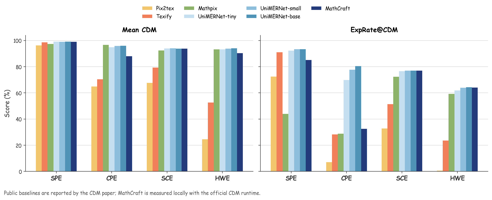
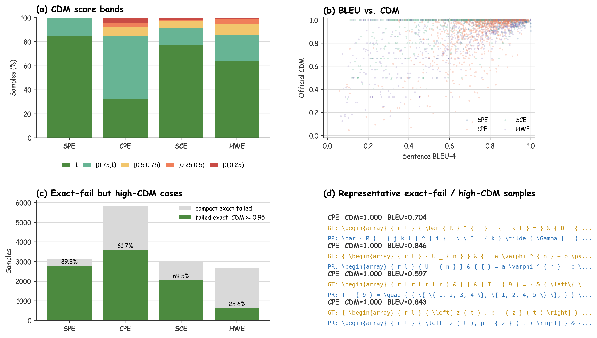
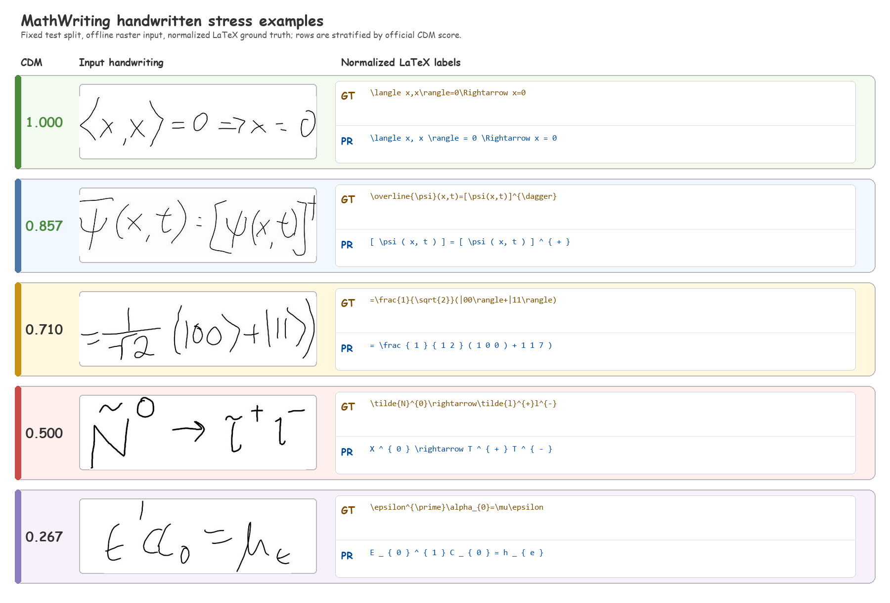
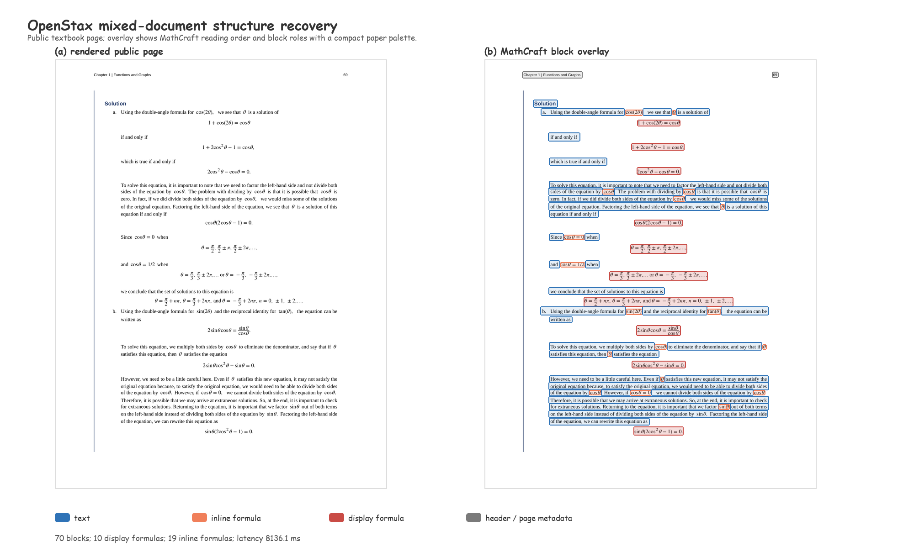

# MathCraft OCR Benchmarks

This directory publishes compact, source-controlled benchmark results for the active MathCraft OCR model set. Large datasets, model weights, and full prediction dumps are intentionally kept outside this repository.

## Results

| Benchmark | Scope | Samples | Reported result | Completion |
| --- | --- | ---: | --- | ---: |
| UniMER-Test | Printed, screen-captured, and handwritten formula OCR | 23,757 | BLEU-4 `0.7946`; official CDM `0.9288` on 23,701 render-evaluable samples | 100% |
| MathWriting test | Independent handwritten formula OCR | 7,644 | BLEU-4 `0.5467`; official CDM `0.750`; prediction render success `98.63%` | 100% |
| OpenStax mixed pages | End-to-end mixed document OCR | 200 pages | Median latency `6.65 s/page`; average `70.4` blocks/page | 100% |

All inference runs used `CUDAExecutionProvider`, with zero runtime failures and zero empty outputs. Latency is hardware-dependent.

## UniMER-Test public context

| Subset | Count | Compact exact | BLEU-4 | Mean CDM | ExpRate@CDM | Median CDM |
| --- | ---: | ---: | ---: | ---: | ---: | ---: |
| All | 23,757 | 38.40% | 0.7946 | 0.9288 | 64.78% | 1.0000 |
| SPE | 6,762 | 53.76% | 0.9212 | 0.9900 | 85.14% | 1.0000 |
| CPE | 5,921 | 1.47% | 0.7564 | 0.8792 | 32.55% | 0.9760 |
| SCE | 4,742 | 36.88% | 0.6962 | 0.9376 | 76.96% | 1.0000 |
| HWE | 6,332 | 57.68% | 0.8481 | 0.9030 | 64.08% | 1.0000 |

Pix2tex, Texify, and UniMERNet-B values are reported by UniMERNet. MathCraft values are measured on the local public UniMER-Test release. This is published-result context, not a controlled rerun of third-party models.

Public baseline values are reported by the CDM paper. MathCraft is evaluated locally with the official CDM runtime.

## Render-aware analysis

Official CDM exposes render-equivalent predictions that exact source matching counts as failures. The diagnostic panels remain separate from the official aggregate metric.

## Independent stress evidence

| MathWriting metric | Value |
| --- | ---: |
| Fixed test samples | 7,644 |
| Compact exact | 11.75% |
| BLEU-4 | 0.5467 |
| Official mean CDM | 0.750 |
| ExpRate@CDM | 16.80% |
| Prediction render success | 98.63% |

MathWriting uses the fixed public test split, offline raster input, and normalized LaTeX labels. It is an independent handwriting stress test, not a handwritten state-of-the-art claim.

| OpenStax subset | Pages | Median latency | Average blocks | Average formula blocks |
| --- | ---: | ---: | ---: | ---: |
| All | 200 | 6.65 s | 70.4 | 24.2 |
| Calculus Volume 1 | 100 | 6.75 s | 72.2 | 26.0 |
| College Algebra | 100 | 6.58 s | 68.6 | 22.3 |

OpenStax evaluates mixed-page completion and structural recovery. It does not provide page-level formula ground truth and is therefore not reported as an accuracy comparison.

## Reproduction and provenance

The checked-in machine-readable snapshot is [`summary.csv`](summary.csv). Figures are synchronized from the MathCraft OCR paper and use the same published-context labels, palette, and protocol boundaries.

The complete manifests, runners, metric implementations, result reports, and protocol notes live in the [LaTeXSnipper benchmark suite](https://github.com/SakuraMathcraft/LaTeXSnipper/tree/main/benchmarks/mathcraft_ocr). The reported values come from these version-controlled result files:

- `results/unimer_test_gpu/unimer_test_gpu_report.md`
- `results/unimer_test_gpu/cdm_official_report.md`
- `results/mathwriting_test_gpu/mathwriting_test_gpu_report.md`
- `results/mathwriting_test_gpu/cdm_official_report.md`
- `results/mathwriting_test_gpu/formula_render_success_report.md`
- `results/openstax_mixed_gpu_144dpi/openstax_report.md`

Third-party datasets retain their original licenses and are not redistributed here.
