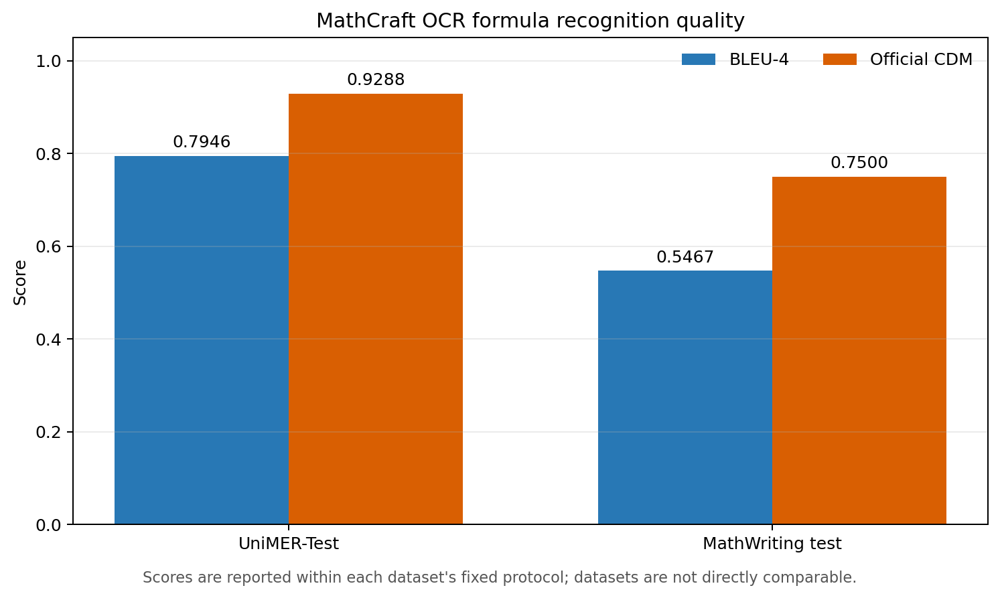
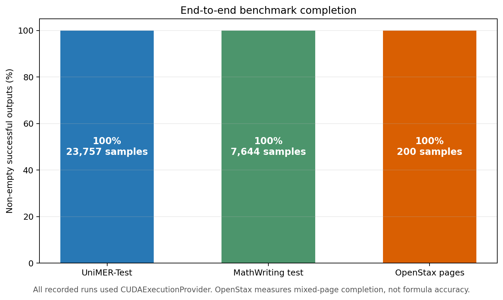

# MathCraft OCR Benchmarks

This directory publishes compact, source-controlled benchmark results for the active MathCraft OCR model set. Large datasets, model weights, and full prediction dumps are intentionally kept outside this repository.

## Results

| Benchmark | Scope | Samples | Reported result | Completion |
| --- | --- | ---: | --- | ---: |
| UniMER-Test | Printed, screen-captured, and handwritten formula OCR | 23,757 | BLEU-4 `0.7946`; official CDM `0.9288` on 23,701 render-evaluable samples | 100% |
| MathWriting test | Independent handwritten formula OCR | 7,644 | BLEU-4 `0.5467`; official CDM `0.750`; prediction render success `98.63%` | 100% |
| OpenStax mixed pages | End-to-end mixed document OCR | 200 pages | Median latency `6.65 s/page`; average `70.4` blocks/page | 100% |

All inference runs used `CUDAExecutionProvider`, with zero runtime failures and zero empty outputs. Latency is hardware-dependent.

### Formula quality



BLEU-4 and official CDM are shown together for each fixed dataset protocol. UniMER-Test and MathWriting have different image sources and evaluation roles, so their bars must not be interpreted as a cross-dataset model ranking.

### End-to-end completion



OpenStax evaluates mixed-page completion and structure rather than formula-level ground-truth accuracy.

## Reproduction and provenance

The checked-in machine-readable snapshot is [`summary.csv`](summary.csv). Regenerate the charts with:

```powershell
python -m pip install matplotlib
python benchmarks/generate_charts.py
```

The complete manifests, runners, metric implementations, result reports, and protocol notes live in the [LaTeXSnipper benchmark suite](https://github.com/SakuraMathcraft/LaTeXSnipper/tree/main/benchmarks/mathcraft_ocr). The reported values come from these version-controlled result files:

- `results/unimer_test_gpu/unimer_test_gpu_report.md`
- `results/unimer_test_gpu/cdm_official_report.md`
- `results/mathwriting_test_gpu/mathwriting_test_gpu_report.md`
- `results/mathwriting_test_gpu/cdm_official_report.md`
- `results/mathwriting_test_gpu/formula_render_success_report.md`
- `results/openstax_mixed_gpu_144dpi/openstax_report.md`

Third-party datasets retain their original licenses and are not redistributed here.
